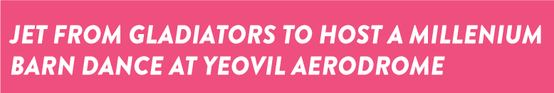
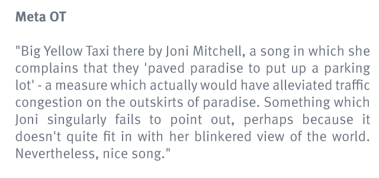

#pebble {code} brand guidelines

##Introduction

This company is more than a collection of individuals. It represents an ethic that is larger than any one individual. We all contribute to it by working here. Where this ethic is presented to the outside world, we call this our brand.

The purpose of brand is to strongly identify things that are consistent with the company ethic. A lot of this is visual, but text, audio, and physical artefacts can all contribute to the brand. 

By taking every opportunity to reinforce the brand, we strengthen ourselves as a team. This contributes directly to the success of the company, and by association you as an individual. 

##Visual Guidelines

The brand assets are kept here. Do not keep a local copy of branded elements such as templates or logos as these are liable to be updated.

**If in doubt about the use of these assets, ask a member of the design team.**

###Logo

There are two logos, the square logo and the rectangle logo. The pebble {code} logo is set in FF Meta Bold.

####Rectangle Logo
This is the default logo. It is used on the company website, and any paper document such as wireframes, statements of work or credentials. There are four versions:
* Pink on white (for print documents).
* White on Pink (for digital documents not intended for print, and the company website).
* Pink on Transparent (for use on top of any other brand colour where appropriate).
* White on Transparent (for emergency use where another background is required. There needs to be a *very* good reason to use this over the other options).

####Square Logo
This logo is primarily for avatar situations, where a square branded element is required. For example in listings sites, or for Github. It should not be used in place of the retangle logo (e.g. on a print document).

###Colour


####Primary Colour

```
**pebble pink**
RGB: 238, 079, 126
HEX: #EE4F7E
HSL:  342, 82, 62
```
​
####Secondary Colours

```
​**pebble blue**
RGB: 014, 162, 220
HEX: #0EA2DC
HSL: 197, 88, 46 
​
**pebble aqua**
RGB: 055, 190, 192
HEX: #37BEC0
HSL: 181, 55, 48
​
**pebble green**
RGB: 164, 206, 078
HEX: #A4CE4E
HSL: 080, 57, 56
​
**pebble purple**
RGB: 155, 092, 164
HEX: #9B5CA4
HSL: 293, 28, 50  
​
**pebble orange**
RGB: 250, 173, 064
HEX: #FAAD40
HSL: 035, 95, 62
```


###Typography

The pebble {code} fonts are:

* Brandon Grotesque (for headings)
* Meta (for body text)

####Headings


Notice that headings are always capitalised. Drop Shadows can be used optionally.

####Body Copy


Body copy uses the pebble ink colour ()


###Lab banner graphics
This branding element is used in places where visual interest is needed to make the banded artefact stand out. Sometimes the pebble pink can become to slab-like and overwhelming. This banner breaks up that effect somewhat. 

