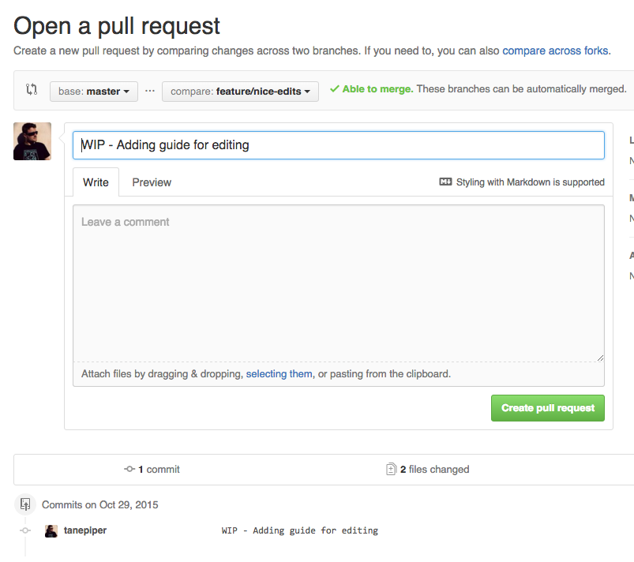

# The Pebble{code} Handbook Guide

## Providing edits

First, clone the repository by typing:

`> git clone git@github.com:pebblecode/pebble-handbook.git` 

Now you have the latest copy on your local machine. To begin, create a new
branch for your content with the command:

`> git checkout -b feature/my-cool-new-content`

You can now begin to edit the files. The files are written in 
[github markdown](https://help.github.com/articles/github-flavored-markdown/)
which allow the documents to be viewed at it's 
[home on github](https://github.com/pebblecode/pebble-handbook).

Once you have made your edits you need to commit these. In the console type

```
> git add .
> git commit -m "Here is my cool edit"
```

Now push these edits up to git by typing:

`> git push origin feature/my-cool-new-content`

(It may tell you to type in something like this instead - you only have to
do this, the first time)

`> git push --set-upstream origin feature/my-cool-new-content`

Next, go to github and you should see a button like this:


Go ahead an click it!  Now you'll be presented with an option to submit your
pull request:



Once this has been created, you can continue to add to it by making more pushes

```
> git add .
> git commit -m "Hey! I made another edit"
> git push
```

When you are ready to submit your content, tell someone to review it and then
they can merge it in to the book - and you've contributed to the company
handbook!